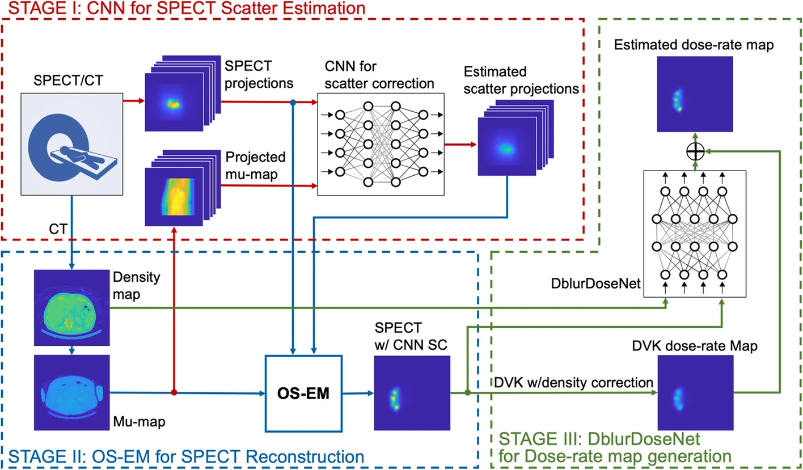

# $^{90}\mathrm{Y}$ SPECT Scatter Estimation and Voxel Dosimetry in Radioembolization using a Unified Deep Learning Framework

This repository contains the official implementation of [Y90 SPECT Scatter Estimation and Voxel Dosimetry in Radioembolization using a Unified Deep Learning Framework](https://ejnmmiphys.springeropen.com/articles/10.1186/s40658-023-00598-9).

## Pipeline Overview

This study explores a deep-learning-based absorbed dose-rate estimation method for 90Y that mitigates the impact of poor SPECT image quality on dosimetry and the accuracy–efficiency trade-off of Monte Carlo (MC)-based scatter estimation and voxel dosimetry methods.



## Code and Datasets

The majority of the code is written in [Python](https://www.python.org). Neural networks are built and trained using the [PyTorch](https://pytorch.org/) automatic differentiation framework. The datasets generated and/or analyzed during the current study are available from the corresponding author on reasonable request.


### Stage I: CNN for SPECT Scatter Estimation

Paper: http://doi.org/10.1007/s00259-020-04840-9

Code template: https://github.com/haoweix/spect-scatter-deep-learning

### Stage II: OS-EM for SPECT Reconstruction

Toolbox: https://web.eecs.umich.edu/~fessler/code/

### Stage III: DblurDoseNet for Dose-rate Map Generation

Paper: https://pubmed.ncbi.nlm.nih.gov/34882821/

Code template: https://github.com/ZongyuLi-umich/DblurDoseNet

Note: use the script run_train.sh and run_test.sh in the folder stageIII for training and testing.


## Citation

If you find this work useful, please cite it as follows:

```bib
@article{jia202390y,
  title={90Y SPECT scatter estimation and voxel dosimetry in radioembolization using a unified deep learning framework},
  author={Jia, Yixuan and Li, Zongyu and Akhavanallaf, Azadeh and Fessler, Jeffrey A and Dewaraja, Yuni K},
  journal={EJNMMI physics},
  volume={10},
  number={1},
  pages={82},
  year={2023},
  publisher={Springer}
}
```
